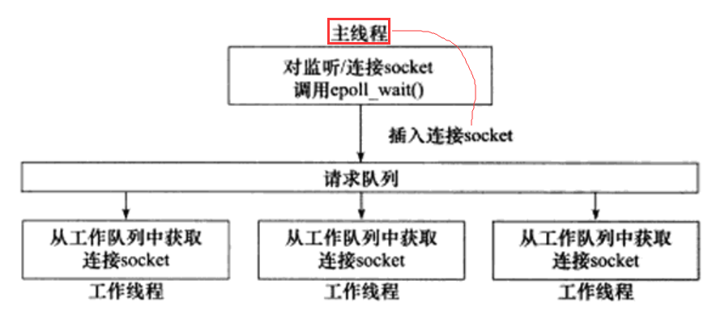
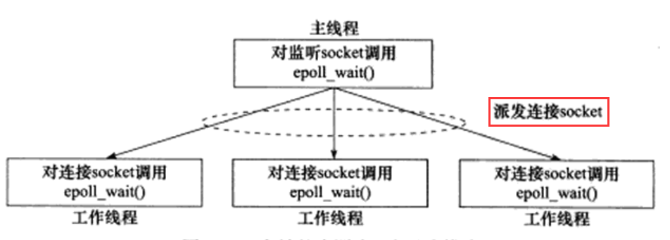
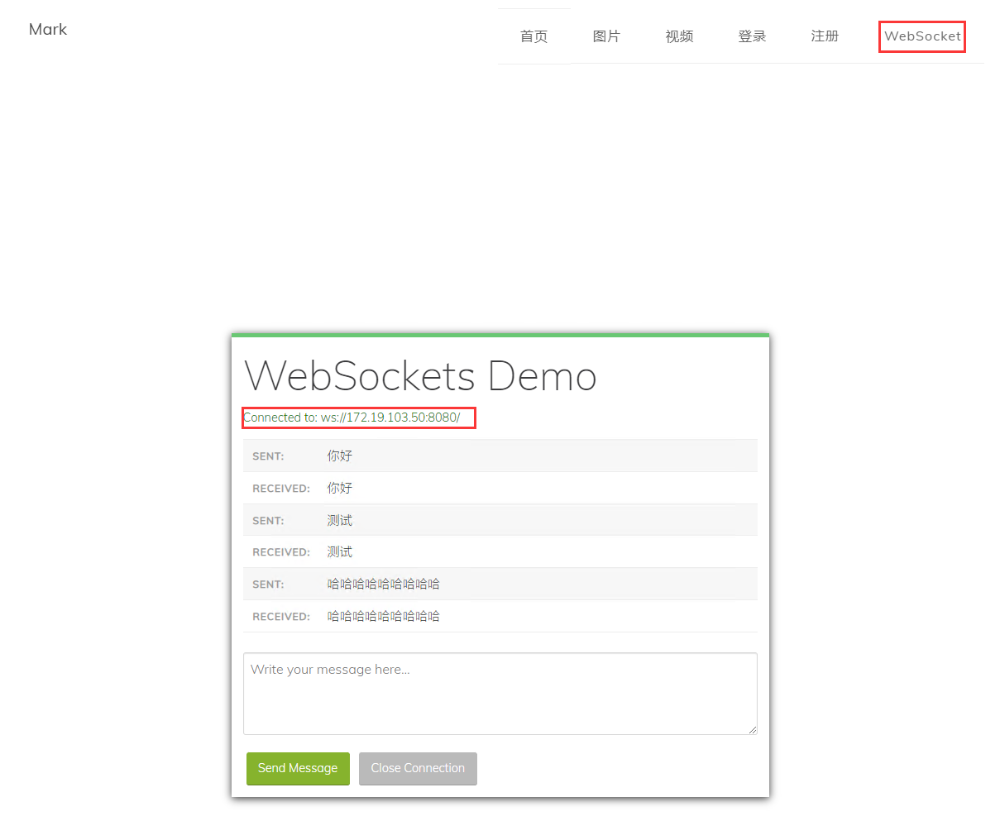

# 基于 Reactor 模式的一个轻量级网络库

## 项目介绍

该项目主要是针对自己之前自己手写的 [Tiny_WebServer](https://github.com/Fightjiang/Tiny_WebServer) 上的改进，学习陈硕大佬的 [Muduo网络库](https://github.com/chenshuo/muduo) 设计和开发，并在此基础上使用 C++11 编码重构分离和简化了 Muduo 对 Boost 库的依赖，提供部分 Http、WebSocket 协议请求解析，提供 JWT 权限认证方式，提供 Mysql 数据库连接池，提供异步日志记录服务器运行信息。

## 项目主要技术点
* 通过 Epoll + LT 模式的 I/O 复用模型实现主从 Reactor 模式网络架构
* 通过「one loop per thread + thread pool」设计思路为每个客户端分配一个线程监听请求
* 通过建立 Mysql 数据库动态连接池实现数据库连接资源的复用
* 通过双缓冲区交互方式实现异步方式记录服务器日志，前台负责往 BufferA 中填充数据，后台通过交换 BufferA 到 BufferB 再将数据持久化到磁盘上
* 通过有限状态机的方法解析 HTTP 请求报文,支持 Web 端的 Get、Post、WebSocket 升级请求解析

## 项目 Reactor 架构图

项目采用主从 Reactor 模式，Main Reactor 只负责监听 accept() 响应并派发新连接给 SubReactor ，随后之后的 SubReactor 负责监听该新连接上的读写事件。采用的 「one loop per thread + thread pool」每个线程都负责监听一个 Reactor , 一般线程数量与 CPU 核的数量保持一致。  

我原项目的半同步半反应堆模式如图所示，会存在以下缺点：

1. 主线程和工作线程共享任务队列。主线程往任务队列中添加任务，或者工作线程从任务队列中取出任务，都需要对任务队列加锁保护，从而白白浪费 CPU 时间。
2. 每个工作线程在同一时间只能处理一个客户请求。如果客户数量比较多，而工作线程较少，则任务队列中将堆积很多任务对象，客户端的响应速度也会越来越慢。故我之前采用的是加入一个监控线程监听线程池中线程工作情况，以实现线程池的自动扩缩容，弥补该缺点。但是工作线程之间的过多来回切换也将耗费 CPU 的时间。

主从 Reactor 模式相比我原来的半同步半反应堆(Reactor)模式克服了以上的缺点，当有新的连接到来时，主线程(MainLoop)将新返回的连接 socketFd 轮询派发给某个工作线程(subLoop)处理，此后该新 socketFd 上任何 I/O 操作都由被选中的工作线程(subLoop)来处理，直到客户关闭连接。 

## 项目网络层数据流分析
项目的数据流分析写在了[这里](./src/net/muduoAnalyse.md)，充分利用了 std::bind 和 functional 将用户的定义的读写回调函数注册到 Loop 中，解耦网络层和业务层。

## 项目环境
* Ubuntu18.04、VScode、g++、C++11、Cmake

## 项目示例

## 项目模块讲解
* [网络层数据流分析](./src/net/muduoAnalyse.md)
* [异步日志模块](./src/log/README.md)
* [数据库连接池模块](./src/mysql/README.md)
* [HTTP、WebSocket解析模块](./src/http/README.md)

## 参考代码库
* [Tiny_WebServer](https://github.com/Fightjiang/Tiny_WebServer)
* [Muduo](https://github.com/chenshuo/muduo)
* [shenmingikMuduo](https://github.com/shenmingik/muduo)