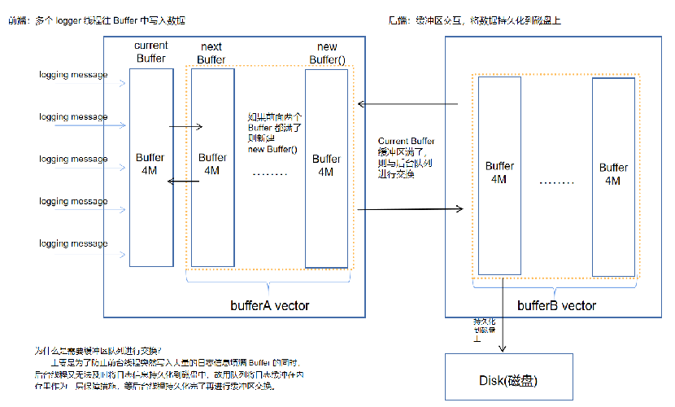

## 日志模块设计

我们定义了 5 种日志等级：(DEBUG/INFO/WARN/ERROR/FATAL)，支持用户自定义日志等级，只有小于等于用户定义的 LOG_LEVEL 级别的日志才会被打印输出，打印日志信息的格式如下所示：
```
显示时间 线程号 日志等级 日志内容 报错文件 报错行号：
2023/07/17 23:41:22 thread id-7327 ERROR: error --logTest.cc:11
```

日志库采用的双缓冲区交互技术，基本思路是准备两块缓冲区：Buffer A 与 Buffer B。 前端 logging 负责往 Buffer A 中填写数据(日志消息) , 后端负责将 Buffer B 中的数据写入可持久化到文件中。 当 Buffer A 写满后唤醒后台线程交换 A 与 B ，让后端线程将交换后的 Buffer B 中数据写入到文件中，而前端线程可以继续往交换后的 Buffer A 中填入新的日志文件，如此反复。

用两个 Buffer 的好处是在写入日志消息的时候不必等待磁盘文件操作，也避免每条消息都触发(唤醒)后端日志线程，换言之，前端线程不是将一条条消息日志分别传送给后端，而是将多个日志消息拼成一个大的 Buffer 传送给后端，相当于批处理，减少了线程唤醒的频率，还减少了与磁盘交互的次数，降低了性能开销。 另外，为了将消息及时写入到文件中，即使前端的 Buffer A未写满，后台线程也会每三秒执行一次上述的交换进行磁盘写入操作。

  

## 前端 Logger

Muduo 为每个日志等级设置了一系列宏函数供用户调用，内部通过判断当前日志等级来拦截日志输出，我们主要看 LOG_BASE 宏定义，通过巧妙的构造一个临时对象来写入日志信息，在构造函数的时候写入 `固定的时间格式 日志等级 日志内容`，在析构函数的时候把数据信息写入到前台 BufferA 缓冲区中(默认输出到终端)
```C++
// LOG_BASE 宏定义
#define LOG_BASE(level, format, ...)\
    do {\
        if (Logger::logLevel() <= level) {\
            Logger(__FILE__, __LINE__, level).writeLog(format, ##__VA_ARGS__);\
        }\
    } while(0);

// Logger 构造函数
Logger::Logger(const char* file, int line , Logger::LogLevel level)  
    : time_(Timestamp::now()),
      buffer_(),
      level_(level),
      line_(line),
      basename_(file)
{
    // 固定的时间格式，输出流 -> time
    formatTime();

    // 写入线程 id 
    buffer_.append("thread id-" + std::to_string(CurrentThread::tid()) + " ");
     
    // 写入日志等级 
    buffer_.append(LogLevelName[level] , ::strlen(LogLevelName[level])) ;
}
// Logger 析构函数
Logger::~Logger()
{
    finish(); // 添加报错文件信息到 buffer_ 中
    // 支持用户自定义写入日志文件的位置 (默认向终端屏幕输出)
    g_output(buffer_.data(), buffer_.length());

    // FATAL情况终止程序
    if (level_ == FATAL)
    {
        g_flush();
        ::abort();
    }
}
```
## 后端 AsyncLogging
后端的 AsyncLogging 类是双缓冲区交互技术实现日志模块的关键部分，因为前端只负责拼凑需要写入的日志字符串，而后端才是需要真正将日志信息持久化到磁盘上。
我们首先看 AsyncLogging 类的头文件 , 我们需要留意的是 `currentBuffer_` 就是上文提到的 BufferA ，为了防止日志写入过快 BufferA 马上写满我们为 BufferA 提供了预备缓冲区 `nextBuffer_` 和 缓冲区队列 `bufferVec_`，所以 `bufferVec_` 才是真正与后台线程的 `buffersToWrite` 交互的。
```C++
class AsyncLogging  
{
private :

    AsyncLogging(int flushInterval = 3);
    ~AsyncLogging() ;

    // FixedBuffer缓冲区类型，而这个缓冲区大小由kLargeBuffer指定，大小为4M，因此，Buffer就是大小为4M的缓冲区类型。
    using Buffer = FixedBuffer<kLargeBuffer>;
    using BufferVector = std::vector<std::unique_ptr<Buffer>>;
    using BufferPtr = BufferVector::value_type;

    void threadFunc() ;

    const int flushInterval_; // 后台线程定期等待 3 秒然后与前端缓冲区交换 ，写入到磁盘的时间  
    
    // 互斥 + 条件变量，保证缓冲区交互的时候，前后台线程操作数据的一致性
    std::atomic<bool> running_; 
    Thread thread_;
    std::mutex mutex_;
    std::condition_variable cond_;

    BufferPtr currentBuffer_; // 当前使用的缓冲区，用于储存前端日志信息，如果不够则会使用预备缓冲区。
    BufferPtr nextBuffer_;   // 预备缓冲区，用于储存前端日志信息，在第一个缓冲区不够时使用
    BufferVector bufferVec_; // 缓冲区队列，用于储存前端日志信息 Buffer 队列，前后台都有交换的缓冲区队列。
};
```
### 前后台线程关键缓冲区交互技术实现

首先前端同时会有多个线程添加日志数据到 BufferA 中，故这个过程需要加锁处理，并且如果超过一个 Buffer 4M 大小的时候，则需要把 Buffer 添加到数组队列中，如下面代码所示
```
// 前端会有多个线程同时 append 数据进来，故需要加锁
void AsyncLogging::append(const char* logline, int len)
{
    std::lock_guard<std::mutex> lock(mutex_);
    if (currentBuffer_->avail() > len) // 缓冲区剩余空间足够则直接写入
    {
        currentBuffer_->append(logline, len);
    }
    else
    {
        // 当前缓冲区空间不够，启用备用缓冲区
        bufferVec_.push_back(std::move(currentBuffer_));
        if (nextBuffer_) 
        {
            currentBuffer_ = std::move(nextBuffer_);
        } 
        else 
        {
            // 备用缓冲区已经使用过了，重新分配新的缓冲区，这种情况很少
            currentBuffer_.reset(new Buffer);
        }
        currentBuffer_->append(logline, len);
        // 唤醒后台线程将 日志信息 写入磁盘
        cond_.notify_one();
    }
}
```
currentBuffer_ 写满了再唤醒 后台线程 与之交互写入日志信息到磁盘中，后台线程负责实现缓冲区交互，`output` 方法就是将日志信息持久化到磁盘上，具体实现看下文。
```
// 后台线程运行的函数
void AsyncLogging::threadFunc()
{
    // output有写入磁盘的接口
    LogFile output ;
    // 后端缓冲区，用于与前端的缓冲区进行交互，currentBuffer nextBuffer
    BufferPtr newBuffer1(new Buffer);
    BufferPtr newBuffer2(new Buffer);
    newBuffer1->bzero();
    newBuffer2->bzero();
    // 缓冲区队列置默认为16个，用于和前端缓冲区队列进行交换，减少锁的占用时间
    BufferVector buffersToWrite;
    buffersToWrite.reserve(16); // reserve 不创建对象，避免多次重复扩容
    while (running_)
    {
        {
            // 互斥锁保护，这样别的线程在这段时间就无法向前端Buffer数组写入数据
            std::unique_lock<std::mutex> lock(mutex_);
            while (running_ && bufferVec_.empty() && currentBuffer_->length() == 0)
            {
                cond_.wait_for(lock, std::chrono::seconds(flushInterval_)); // 默认等待三秒也会自动解除阻塞
            }

            // 此时正使用的 currentbuffer 也放入 currentbuffer 数组中（没写完也放进去，避免等待太久才刷新一次）
            bufferVec_.push_back(std::move(currentBuffer_));
            // 归还正使用缓冲区
            currentBuffer_ = std::move(newBuffer1);
            // 后端缓冲区队列 和 前端缓冲区队列交换
            buffersToWrite.swap(bufferVec_);
            // 检查备用缓冲区是否启用，启用则进行交换
            if (!nextBuffer_)
            {
                nextBuffer_ = std::move(newBuffer2);
            }
        }
        //锁已经被释放，后台线程遍历所有 buffer，将其写入文件
        for (const auto& buffer : buffersToWrite)
        {
            output.append(buffer->data(), buffer->length());
        }

        // 只保留两个缓冲区
        if (buffersToWrite.size() > 2)
        {
            buffersToWrite.resize(2);
        }

        // 归还newBuffer1缓冲区
        if (!newBuffer1)
        {
            newBuffer1 = std::move(buffersToWrite.back());
            buffersToWrite.pop_back();
            newBuffer1->reset();
        }

        // 归还newBuffer2缓冲区
        if (!newBuffer2)
        {
            newBuffer2 = std::move(buffersToWrite.back());
            buffersToWrite.pop_back();
            newBuffer2->reset();
        }

        buffersToWrite.clear(); // 清空后端缓冲区队列
        output.flush(); //清空文件缓冲区
    }
    output.flush();
}
```

## 日志信息持久化 LogFile
写入日志信息到磁盘上，具体还支持判断是否要新建一个日志文件(如：一个 log 文件超过一天就创建新的）等。
```
void LogFile::FileUtil::append(const char* data, size_t len)
{
    // 记录已经写入的数据大小
    size_t written = 0;

    while (written != len)
    {
        // 还需写入的数据大小
        size_t remain = len - written;
        size_t n = write(data + written, remain);
        if (n != remain)
        {
            int err = ferror(fp_);
            if (err)
            {
                fprintf(stderr, "FileUtil::append() failed %s\n", getErrnoMsg(err));
            }
        }
        // 更新写入的数据大小
        written += n;
    }
    // 记录目前为止写入的数据大小，超过限制会滚动日志
    writtenBytes_ += written;
}
```

