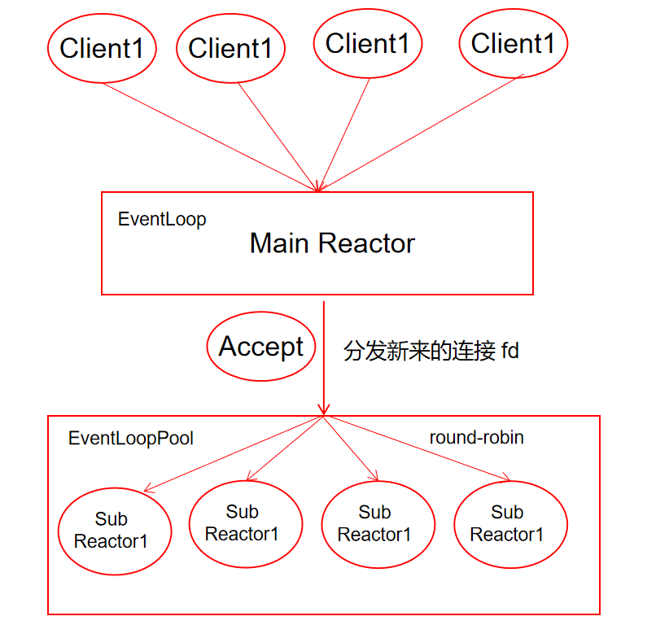

最近自己实现了一个 [Tiny_WebServer](https://github.com/Fightjiang/Tiny_WebServer) 服务器，是一个半同步半反应堆的模式，具体可以看我 github 上面的描述。但是春招实习二面被面试官表示项目太简单了，疯狂被怼分布式、集群等知识，故想进一步重构项目，无奈我实现的 Tiny_WebServer 中业务逻辑和网络Socket层之间耦合性太强，再基于源项目重构的话其实跟重写没有区别了，并且我没有好的设计思路。这个时候找到了陈硕大神的 muduo 网络库，正好可以满足我的需要，解耦网络层与业务层，故拜读大神的源码设计，越往读越觉得自己上面的 Tiny_WebServer 是个什么垃圾[捂脸] 。以下内容适合对网络编程有一定基础的看，并且对 muduo 网络库稍微了解下。

# 从简单的 EchoServer 代码入手，分析 muduo 网络库数据流

```cpp
#include "muduo/net/TcpServer.h"
#include "muduo/base/Logging.h"

class EchoServer
{
 public:
  EchoServer(muduo::net::EventLoop* loop,
             const muduo::net::InetAddress& listenAddr);

  void start();  // calls server_.start();

 private:
  void onConnection(const muduo::net::TcpConnectionPtr& conn);

  void onMessage(const muduo::net::TcpConnectionPtr& conn,
                 muduo::net::Buffer* buf,
                 muduo::Timestamp time);

  muduo::net::TcpServer server_;
};

using std::placeholders::_1;
using std::placeholders::_2;
using std::placeholders::_3;

// using namespace muduo;
// using namespace muduo::net;

EchoServer::EchoServer(muduo::net::EventLoop* loop,
                       const muduo::net::InetAddress& listenAddr)
  : server_(loop, listenAddr, "EchoServer")
{
  server_.setConnectionCallback(
      std::bind(&EchoServer::onConnection, this, _1));
  server_.setMessageCallback(
      std::bind(&EchoServer::onMessage, this, _1, _2, _3));
}

void EchoServer::start()
{
  server_.start();
}

void EchoServer::onConnection(const muduo::net::TcpConnectionPtr& conn)
{
  LOG_INFO << "EchoServer - " << conn->peerAddress().toIpPort() << " -> "
           << conn->localAddress().toIpPort() << " is "
           << (conn->connected() ? "UP" : "DOWN");
}

void EchoServer::onMessage(const muduo::net::TcpConnectionPtr& conn,
                           muduo::net::Buffer* buf,
                           muduo::Timestamp time)
{
  muduo::string msg(buf->retrieveAllAsString());
  LOG_INFO << conn->name() << " echo " << msg.size() << " bytes, "
           << "data received at " << time.toString();
  conn->send(msg);
}

int main()
{
  LOG_INFO << "pid = " << getpid();
  muduo::net::EventLoop loop;
  muduo::net::InetAddress listenAddr(2007);
  EchoServer server(&loop, listenAddr);
  server.start();
  loop.loop();
}
```

## 一、服务端接收客户端连接数据流分析

### 一、EventLoop

首先看到主函数 main() 中定义的 EventLoop ，这是 muduo 网络库的核心知识，它的核心是个事件循环 Loop 用于响应计时器和 IO 事件。main() 函数中的 loop 定义可以理解为是一个 main_loop 用于处理新客户端的连接响应。用户一行代码，再看看封装了那些处理，首先当然是要看 EventLoop 的构造函数。

```cpp
EventLoop::EventLoop()
  : looping_(false),
    quit_(false),
    eventHandling_(false),
    callingPendingFunctors_(false),
    iteration_(0),
    threadId_(CurrentThread::tid()),
    poller_(Poller::newDefaultPoller(this)),
    timerQueue_(new TimerQueue(this)),
    wakeupFd_(createEventfd()),
    wakeupChannel_(new Channel(this, wakeupFd_)),
    currentActiveChannel_(NULL)
{
  LOG_DEBUG << "EventLoop created " << this << " in thread " << threadId_;
  if (t_loopInThisThread)
  {
    LOG_FATAL << "Another EventLoop " << t_loopInThisThread
              << " exists in this thread " << threadId_;
  }
  else
  {
    t_loopInThisThread = this;
  }
  wakeupChannel_->setReadCallback(
      std::bind(&EventLoop::handleRead, this));
  // we are always reading the wakeupfd
  wakeupChannel_->enableReading();
}
```

可以看到 EventLoop() 的构造函数中，除了像 looping_、quit_等标记的定义，还构造 poller_ 、timerQueue_、Channel_ ，这些就可以先不关注代码细节，只需要知道 poller_ 就是用于 I/O 多路复用监听就绪事件的；timerQueue_ 定时器用于处理长时间未活跃连接；Channel_ 辅助poller_响应执行就绪事件的回调函数。注意的是一个线程有且只有一个 EventLoop 。

这里有个设计思想非常棒，就是新增的 wakeupFd_ 和它对应的 wakeupChannel_ ，可以实现随时唤醒阻塞在 poller 上的线程，再执行当前 Eventloop 中需要处理的回调函数。`wakeupChannel_->setReadCallback();wakeupChannel_->enableReading();`构造函数中的这两行代码，就让当前 poller_ 会一直监听 wakeupfd 上的可读事件，达到随时唤醒 loop 线程的目的。

好了，现在我们可以知道的是第一行代码 `muduo::net::EventLoop loop;` 大概就是定义了一个 poller_ 等待用户往里面注册要监听的就绪事件。main() 中的第二行代码`muduo::net::InetAddress listenAddr(2007);` 就比较通俗易懂了，InetAddress 类的作用就是方便定义或者获取套接字的 IP：port 等。

### 二、TcpServer

main() 中的第三行代码`EchoServer server(&loop, listenAddr);` 这个牵扯到的知识就非常多了，还是一样，我们首先看 EchoServer 的构造函数内的内容。

```cpp
EchoServer::EchoServer(muduo::net::EventLoop* loop,
                       const muduo::net::InetAddress& listenAddr)
  : server_(loop, listenAddr, "EchoServer")
{
  server_.setConnectionCallback(
      std::bind(&EchoServer::onConnection, this, _1));
  server_.setMessageCallback(
      std::bind(&EchoServer::onMessage, this, _1, _2, _3));
}
```

变量 server_ 的构造牵扯到的知识非常丰富 `muduo::net::TcpServer server_;` ，它是属于 TcpServer 类，再看 TcpServer 的构造函数。

```cpp
TcpServer::TcpServer(EventLoop* loop,
                     const InetAddress& listenAddr,
                     const string& nameArg,
                     Option option)
  : loop_(CHECK_NOTNULL(loop)),
    ipPort_(listenAddr.toIpPort()),
    name_(nameArg),
    acceptor_(new Acceptor(loop, listenAddr, option == kReusePort)),
    threadPool_(new EventLoopThreadPool(loop, name_)),
    connectionCallback_(defaultConnectionCallback),
    messageCallback_(defaultMessageCallback),
    nextConnId_(1)
{
  acceptor_->setNewConnectionCallback(
      std::bind(&TcpServer::newConnection, this, _1, _2));
}
```

loop_ 还是主线程main()第一行代码创建的 EventLoop ，acceptor 看到是不是特别熟悉，它就是对系统调用 ::accept 的封装，用于连接新的客户端请求。EventLoopThreadPool 是一个 EventLoop 池，建立连接之后的每个 TcpConnection 必须归某个 EventLoop 管理，连接描述符的所有的 IO 会转移到这个 loop 线程，`one loop per thread` 说的就是在这里。

### 三、TcpConnection

我们接着看建立连接成功之后执行的回调函数`acceptor_->setNewConnectionCallback(std::bind(&TcpServer::newConnection, this, _1, _2));`。这里我直接在代码上添加注释了，保证每行都给你看明白。

```cpp
void TcpServer::newConnection(int sockfd, const InetAddress& peerAddr)
{
  loop_->assertInLoopThread();
  // 从EventLoop线程池中，取出一个EventLoop管理TcpConnection对象，getNextLoop()是采用的轮流处理的方式
  EventLoop* ioLoop = threadPool_->getNextLoop();
  char buf[64];
  snprintf(buf, sizeof buf, "-%s#%d", ipPort_.c_str(), nextConnId_);
  ++nextConnId_;
  // 设置连接对象名称, 包含 TcpServer 名称 + ip地址 + 端口号 + 目前是第几个连接号
  // 作为 connectionsmap 的key , 运行期间确保唯一性
  string connName = name_ + buf;

  LOG_INFO << "TcpServer::newConnection [" << name_
           << "] - new connection [" << connName
           << "] from " << peerAddr.toIpPort();
  InetAddress localAddr(sockets::getLocalAddr(sockfd));
  // FIXME poll with zero timeout to double confirm the new connection
  // FIXME use make_shared if necessary
  // 新建 TcpConnection 对象，加入 connections_ 中
  TcpConnectionPtr conn(new TcpConnection(ioLoop,
                                          connName,
                                          sockfd,
                                          localAddr,
                                          peerAddr));
  connections_[connName] = conn;
  // 设置各种回调函数，注意看这里的回调函数，就是用户设置的回调函数，也就是本例中 EchoServer 设置的回调函数
  conn->setConnectionCallback(connectionCallback_); 		// 新客户端连接回调
  conn->setMessageCallback(messageCallback_);				// 接收到客户端消息，再处理发送消息给客户端的回调
  conn->setWriteCompleteCallback(writeCompleteCallback_);	// 发送完消息的回调
  conn->setCloseCallback(									// 关闭连接回调
      std::bind(&TcpServer::removeConnection, this, _1)); // FIXME: unsafe
  // 初始化建立连接之后的设置 
  ioLoop->runInLoop(std::bind(&TcpConnection::connectEstablished, conn));
}
```

看完上面的代码，整体思路应该相对来说清楚了不少叭，在捋捋就是: 

1. 在这个示例中 TcpServer 是整个 muduo 库中唯一要跟用户交互的类，用户设置服务器监听到相应就绪事件后的处理执行方式。
2. 陈硕作者提出的 `one loop per thread + thread pool` 模型也在该代码中得到了体现，每个线程最多有一个 EventLoop，每个 TcpConnection 必须归某个 EventLoop 管理，所有的 IO 会转移到这个线程。TcpConnection 所在的线程由其所属的 EventLoop 决定，新到的连接会按 round-robin 方式分配到线程池中。
3. 简单的说，就是这个新建立好的连接归 EventLoopPool 中的某个 EventLoop 负责管理了，也就是代码中的 ioLoop 。

还没有完，还有一个非常巧妙的设计，我们再看TcpConnection的类定义和它的构造函数.

```cpp
class TcpConnection : noncopyable,
                      public std::enable_shared_from_this<TcpConnection>
{
	...............
}

TcpConnection::TcpConnection(EventLoop* loop,
                             const string& nameArg,
                             int sockfd,
                             const InetAddress& localAddr,
                             const InetAddress& peerAddr)
  : loop_(CHECK_NOTNULL(loop)),
    name_(nameArg),
    state_(kConnecting),
    reading_(true),
    socket_(new Socket(sockfd)),
    channel_(new Channel(loop, sockfd)),
    localAddr_(localAddr),
    peerAddr_(peerAddr),
    highWaterMark_(64*1024*1024)
{
  channel_->setReadCallback(
      std::bind(&TcpConnection::handleRead, this, _1));
  channel_->setWriteCallback(
      std::bind(&TcpConnection::handleWrite, this));
  channel_->setCloseCallback(
      std::bind(&TcpConnection::handleClose, this));
  channel_->setErrorCallback(
      std::bind(&TcpConnection::handleError, this));
  LOG_DEBUG << "TcpConnection::ctor[" <<  name_ << "] at " << this
            << " fd=" << sockfd;
  socket_->setKeepAlive(true);
}
```

`TcpConnection` 这里引入了 `enable_shared_from_this`，它可以在对象内部获得一个指向自己的 `shared_ptr`。这样，当回调函数需要持续使用该对象时，可以通过 `shared_from_this` 方法获取对象的 `shared_ptr`，从而确保对象在持续使用时不会被提前销毁。第一次见，很骚的一个操作，目的就是为了回调函数完整执行。

再看看newConnection中最后一行代码`ioLoop->runInLoop(std::bind(&TcpConnection::connectEstablished, conn));`这行代码所带来的效果，它会执行一个回调函数，也就是下面这个。

```cpp
void TcpConnection::connectEstablished()
{
  loop_->assertInLoopThread();
  assert(state_ == kConnecting);
  setState(kConnected);
  // 把 TcpConnection 绑定到 channel 上， 避免循环引用故 channel 中用的是 weak_ptr<void> 如下面代码所示
  channel_->tie(shared_from_this());
  // channel 置于可读状态中，也就是把 poller_ 设置为一直监听可读事件
  channel_->enableReading();
  // 至此，连接成功建立，执行连接建立成功的回调函数
  connectionCallback_(shared_from_this());
}

void Channel::tie(const std::shared_ptr<void>& obj)
{
  tie_ = obj; // std::weak_ptr<void> tie_;
  tied_ = true;
}
// 为什么要 tie_ 的这么复杂？我看源代码得出的最终结论就是，确保回调函数成功执行，而不会出现执行的时候出现 TcpConnection 析构，保证安全。
// handleEventWithGuard 就行具体的执行回调函数的地方，再执行前 weak_ptr::lock可将weak_ptr提升为shared_ptr, 引用计数+1 ，执行完毕又 -1 , 太棒了。
void Channel::handleEvent(Timestamp receiveTime)
{
  std::shared_ptr<void> guard;
  if (tied_)
  {
    guard = tie_.lock();
    if (guard)
    {
      handleEventWithGuard(receiveTime);
    }
  }
  else
  {
    handleEventWithGuard(receiveTime);
  }
}
```

好了至此，连接部分介绍完毕，`channel_->enableReading();` 使得 EventLoop 会一直监听该文件描述符上的读就绪事件，我总结为以下一张图，经典的 Reactor 模型。


# 二、服务端与客户端读写数据流分析

建立完连接时`TcpConnection::connectEstablished()`中的这行代码`channel_->enableReading();`，是服务端让 poller 监听连接 fd 上的可读就绪事件，也就是当客户端发送数据过来会触发EventLoop 中的死循环的 epoll_wait 的代码，也就是如下代码所示 。

```cpp
void EventLoop::loop()
{
  assert(!looping_);
  assertInLoopThread();
  looping_ = true;
  quit_ = false;  // FIXME: what if someone calls quit() before loop() ?
  LOG_TRACE << "EventLoop " << this << " start looping";

  while (!quit_)
  {
    activeChannels_.clear();
    // 监听所有通道就绪事件, 会阻塞当前线程, 所有就绪事件对应通道会填入activeChannels_
    pollReturnTime_ = poller_->poll(kPollTimeMs, &activeChannels_);
    ++iteration_;
    if (Logger::logLevel() <= Logger::TRACE)
    {
      printActiveChannels();
    }
    // TODO sort channel by priority
    eventHandling_ = true;
    // 处理所有的就绪事件
    for (Channel* channel : activeChannels_)
    {
      currentActiveChannel_ = channel;
      currentActiveChannel_->handleEvent(pollReturnTime_);
    }
    currentActiveChannel_ = NULL;
    eventHandling_ = false;
    // 处理其他线程要求执行的回调函数任务，如果有的话
    doPendingFunctors();
  }

  LOG_TRACE << "EventLoop " << this << " stop looping";
  looping_ = false;
}
```

可以看到当前线程会阻塞在 `poller_->poll(kPollTimeMs, &activeChannels_);` 上等待唤醒，唤醒之后的代码就是将所有就绪事件对应通道会填入activeChannels_，如下所示。

```cpp
Timestamp EPollPoller::poll(int timeoutMs, ChannelList* activeChannels)
{
  LOG_TRACE << "fd total count " << channels_.size();
  int numEvents = ::epoll_wait(epollfd_,
                               &*events_.begin(),
                               static_cast<int>(events_.size()),
                               timeoutMs);
  ....
  ....
  if (numEvents > 0)
  {
    LOG_TRACE << numEvents << " events happened";
    fillActiveChannels(numEvents, activeChannels);
     ....
	 ....
  }
  ....
  ....
  return now;
}

void EPollPoller::fillActiveChannels(int numEvents,
                                     ChannelList* activeChannels) const
{
  assert(implicit_cast<size_t>(numEvents) <= events_.size());
  for (int i = 0; i < numEvents; ++i)
  {
    Channel* channel = static_cast<Channel*>(events_[i].data.ptr);
  	....
  	....
    channel->set_revents(events_[i].events);
    activeChannels->push_back(channel);
  }
}
```

然后执行 `activeChannels_`中的就绪事件任务。

```cpp
void Channel::handleEvent(Timestamp receiveTime)
{
  std::shared_ptr<void> guard;
  if (tied_)
  {
    guard = tie_.lock();
    if (guard)
    {
      handleEventWithGuard(receiveTime);
    }
  }
  else
  {
    handleEventWithGuard(receiveTime);
  }
}

void Channel::handleEventWithGuard(Timestamp receiveTime)
{
  eventHandling_ = true;
  LOG_TRACE << reventsToString();
  if ((revents_ & POLLHUP) && !(revents_ & POLLIN))
  {
     .... 
    if (closeCallback_) closeCallback_();
  }
  .... 
  if (revents_ & (POLLERR | POLLNVAL))
  {
    if (errorCallback_) errorCallback_();
  }
  if (revents_ & (POLLIN | POLLPRI | POLLRDHUP))
  {
    if (readCallback_) readCallback_(receiveTime);
  }
  if (revents_ & POLLOUT)
  {
    if (writeCallback_) writeCallback_();
  }
  eventHandling_ = false;
}
```

还有一部分就是其他线程加入的就绪事件处理，可以通过`wakeup`唤醒线程，调用 `doPendingFunctors();`处理。

```cpp
void EventLoop::doPendingFunctors()
{
  std::vector<Functor> functors;
  callingPendingFunctors_ = true;
   // 为什么要交互？ 减少持有锁的时间，提高并发
  {
  MutexLockGuard lock(mutex_);
  functors.swap(pendingFunctors_);
  }

  for (const Functor& functor : functors)
  {
    functor();
  }
  callingPendingFunctors_ = false;
}
```

总结：这部分的数据流从整体上好理解，但是数据的代码实现比较细节，陈硕大神的代码非常优美，建议看源码，Poller;Channel;EventLoop 之间的来回调用。

# 三、服务端与客户端断开数据流分析

## 1. 客户端关闭连接，服务端被动关闭连接，read() == 0 触发关闭逻辑

客户端关闭连接，服务端的 read() 函数会返回0，然后再开始走 handleClose() 的逻辑，也就是这一部分，当 n==0开始的逻辑。

```cpp
void TcpConnection::handleRead(Timestamp receiveTime)
{
  loop_->assertInLoopThread();
  int savedErrno = 0;
  ssize_t n = inputBuffer_.readFd(channel_->fd(), &savedErrno);
  if (n > 0)
  {
    messageCallback_(shared_from_this(), &inputBuffer_, receiveTime);
  }
  else if (n == 0)//客户端断开连接
  {
    handleClose();
  }
  else
  {
    errno = savedErrno;
    LOG_SYSERR << "TcpConnection::handleRead";
    handleError();
  }
}
```

再看看 handleClose() 函数，做了那些工作

```cpp
void TcpConnection::handleClose()
{
  loop_->assertInLoopThread();
  LOG_TRACE << "fd = " << channel_->fd() << " state = " << stateToString();
  assert(state_ == kConnected || state_ == kDisconnecting);
  // we don't close fd, leave it to dtor, so we can find leaks easily.
  setState(kDisconnected);
   // 让 epoll 停止监听所有fd的所有事件(读写事件)，做法就是把 event 事件置空
  channel_->disableAll();

  TcpConnectionPtr guardThis(shared_from_this());
  //执行关闭连接的回调，用户设置的
  connectionCallback_(guardThis);
   //关闭连接的回调，muduo 定义的
  // must be the last line
  closeCallback_(guardThis);
}
```

要想知道 close_callback_ 做了什么，需要回到 TcpServer 在构造 TcpConnection 时做了那些设置工作

```cpp
void TcpServer::newConnection(int sockfd, const InetAddress& peerAddr)
{
  loop_->assertInLoopThread();
  EventLoop* ioLoop = threadPool_->getNextLoop();
  ...
  ...
  ...
  // close_callback_ 执行的就是这里设置的回调函数 
  conn->setCloseCallback(
      std::bind(&TcpServer::removeConnection, this, _1)); // FIXME: unsafe
  ioLoop->runInLoop(std::bind(&TcpConnection::connectEstablished, conn));
}
// 发现这两个函数，其实是套娃函数回调调用，为什么要这样套娃呢？因为要保证线程安全，如果是 io_loop 直接回调过来执行，那么 TcpServer 中的资源就不是 main_loop 独占了，存在线程不安全
void TcpServer::removeConnection(const TcpConnectionPtr& conn)
{
  // FIXME: unsafe
  loop_->runInLoop(std::bind(&TcpServer::removeConnectionInLoop, this, conn));
}

void TcpServer::removeConnectionInLoop(const TcpConnectionPtr& conn)
{
  // 保证线程安全调用
  loop_->assertInLoopThread();
  LOG_INFO << "TcpServer::removeConnectionInLoop [" << name_
           << "] - connection " << conn->name();
  // 总的 TcpServer 中的 connections_ 移除
  size_t n = connections_.erase(conn->name());
  (void)n;
  assert(n == 1);
  EventLoop* ioLoop = conn->getLoop();
  // 再从 ioLoop 中的删除 epoll 监听的连接描述符
  ioLoop->queueInLoop(
      std::bind(&TcpConnection::connectDestroyed, conn));
}
void TcpConnection::connectDestroyed()
{
  loop_->assertInLoopThread();
  if (state_ == kConnected)
  {
    setState(kDisconnected);
    channel_->disableAll();
    connectionCallback_(shared_from_this());
  }
  channel_->remove();
}
void Channel::remove()
{
  assert(isNoneEvent());
  addedToLoop_ = false;
  loop_->removeChannel(this);
}
void EventLoop::removeChannel(Channel* channel)
{
  assert(channel->ownerLoop() == this);
  assertInLoopThread();
  if (eventHandling_)
  {
    assert(currentActiveChannel_ == channel ||
        std::find(activeChannels_.begin(), activeChannels_.end(), channel) == activeChannels_.end());
  }
  poller_->removeChannel(channel);
}
void EPollPoller::removeChannel(Channel* channel)
{
  Poller::assertInLoopThread();
  int fd = channel->fd();
  LOG_TRACE << "fd = " << fd;
  assert(channels_.find(fd) != channels_.end());
  assert(channels_[fd] == channel);
  assert(channel->isNoneEvent());
  int index = channel->index();
  assert(index == kAdded || index == kDeleted);
  size_t n = channels_.erase(fd);
  (void)n;
  assert(n == 1);

  if (index == kAdded)
  {
  	// 执行 epoll 的删除
    update(EPOLL_CTL_DEL, channel);
  }
  channel->set_index(kNew);
}
```

从上面的回调流程大概就是：

1. io_loop 监听到 read() 就绪，执行 handleRead() ，结果 read() 返回 0 ，客户端主动关闭连接了，故再执行 handleClose; 
2. handleClose() 执行在构造 TcpConnection 的时候用户定义的回调函数和 muduo 库定义的关闭连接回调函数removeConnection()
3. TcpServer 首先会删除对应的连接资源，然后再让负责该连接的 EventLoop 执行它的删除步骤
4. EventLoop -> io_loop 首先会调用对应的 channel->remove() 函数，然后再通知 epoller 删除步骤。
5. 最后这里非常棒的设计还是，所有的 TcpConnection 都是 shared_ptr 负责析构的，所以当删除步骤都执行完毕了，引用计数为 0，执行析构关闭 close(fd) ；(TcpConnection 中的 socket 是 unique_ptr 负责，TcpConnection 析构 -> socket 析构)

## 2. 服务端主动发起关闭连接 

服务端主动关闭客户端连接的函数如下所示，其实最后还是调用上面分析到的 `handleClose();` ，和 read() == 0 一样的数据流走向。

```cpp
void TcpConnection::forceClose()
{
  // FIXME: use compare and swap
  if (state_ == kConnected || state_ == kDisconnecting)
  {
    setState(kDisconnecting);
    loop_->queueInLoop(std::bind(&TcpConnection::forceCloseInLoop, shared_from_this()));
  }
}

void TcpConnection::forceCloseWithDelay(double seconds)
{
  if (state_ == kConnected || state_ == kDisconnecting)
  {
    setState(kDisconnecting);
    loop_->runAfter(
        seconds,
        makeWeakCallback(shared_from_this(),
                         &TcpConnection::forceClose));  // not forceCloseInLoop to avoid race condition
  }
}

void TcpConnection::forceCloseInLoop()
{
  loop_->assertInLoopThread();
  if (state_ == kConnected || state_ == kDisconnecting)
  {
    // as if we received 0 byte in handleRead();
    handleClose();
  }
}

```

